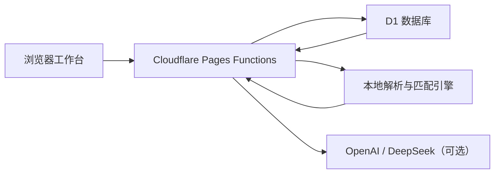

# OfferMate

OfferMate 是一个面向学生求职和校招 HR 的双端求职匹配应用。它把 PDF 简历解析、岗位 JD 解析、可解释评分、真实岗位投递和候选人复核串成一条完整流程，而不是只展示一张静态匹配结果页。

项目使用原生 HTML、CSS 和 JavaScript 构建前端，后端运行在 Cloudflare Pages Functions，业务数据保存在 D1。没有配置外部模型时，内置解析器仍能完成文本型简历和岗位匹配；配置 OpenAI 或 DeepSeek 后，可以补充 OCR 和结构化画像解析。

## 已实现功能

### 求职者端

- 邮箱注册、登录和七天会话。
- 上传 PDF 或使用示例简历，保留解析历史与匹配记录。
- 自动提取姓名、教育、技能、语言、软技能、经历证据和求职偏好。
- 在同一公司岗位池中比较匹配分、关键词缺口、评分维度和证据链。
- 生成岗位定制的简历片段与下一步补强建议。
- 把当前简历真实投递到目标岗位，查看投递状态，并支持撤回。

### HR 端

- 粘贴 JD 新增岗位，自动抽取薪资、技能、软技能、语言和职责。
- 按已投递优先、匹配分和上传时间组织候选人队列。
- 按姓名、技能或岗位搜索，并筛选已投递、待分流和高匹配候选人。
- 查看候选人的原简历、已投岗位、评分拆解、团队互补和面试问题。
- 下载上传时保存的原始 PDF；文件过大时自动提供文本版本。

### 管理与平台能力

- 管理员创建或删除求职者、HR 和管理员账号。
- 简历正文、账号身份字段和访问日志敏感信息使用 AES-GCM 加密后写入 D1。
- 受 token 保护的访问统计页面支持 HTML 和 JSON 输出。
- Pages 中间件会阻止直接访问数据库脚本、后端源码、测试和配置文件。

## 架构



核心数据流：

1. 求职者上传简历，后端先提取 PDF 文本，必要时调用 OpenAI OCR。
2. DeepSeek、OpenAI 或本地解析器把文本转换为统一候选人画像。
3. 匹配引擎针对每个岗位保存分数、命中标签、原因和评分明细。
4. 求职者投递后，`applications` 记录会把用户、岗位和当时的简历版本关联起来。
5. HR 候选人池读取真实投递记录，并结合最近一次匹配结果生成复核视图。

## 本地运行

### 环境要求

- Node.js 22 或更新版本。
- npm。
- Wrangler 4。命令使用 `npx`，不要求全局安装。

### 1. 初始化本地 D1

```bash
npx wrangler d1 execute offermate_visits --local --file=db/schema.sql
```

应用首次请求时也会检查并补齐表结构；显式执行一次 schema 更方便确认本地配置是否正确。Wrangler 默认把本地 D1 数据保存在 `.wrangler/state`。

### 2. 配置本地环境变量

在仓库根目录创建 `.dev.vars`。只放当前开发环境需要的值，不要提交该文件。

```dotenv
OFFERMATE_ENCRYPTION_KEY="replace-with-a-long-random-value"
VISIT_ADMIN_TOKEN="replace-with-a-private-dashboard-token"

# 二选一或同时配置
DEEPSEEK_API_KEY="your-deepseek-key"
OPENAI_API_KEY="your-openai-key"
```

没有 AI key 也可以运行。文本型 PDF 会使用本地提取与解析；图片扫描件需要 OpenAI OCR 才能可靠识别。

### 3. 启动 Pages Functions

```bash
npx wrangler pages dev . --port 4173
```

打开 [http://127.0.0.1:4173/](http://127.0.0.1:4173/)。请不要使用普通静态文件服务器，登录、上传、投递和 D1 都依赖 Pages Functions。

## 环境变量

| 变量 | 用途 | 是否必需 |
| --- | --- | --- |
| `OFFERMATE_ENCRYPTION_KEY` | 加密账号、简历和访问日志中的敏感字段 | 生产环境必需 |
| `DEEPSEEK_API_KEY` | 优先用于结构化简历画像 | 可选 |
| `OPENAI_API_KEY` | PDF OCR，也可用于结构化画像 | 扫描 PDF 场景建议配置 |
| `OPENAI_PROFILE_API_KEY` | 只用于结构化画像，可与 OCR key 分离 | 可选 |
| `OPENAI_OCR_MODEL` | 覆盖默认 OCR 模型 | 可选 |
| `OPENAI_PROFILE_MODEL` | 覆盖默认画像解析模型 | 可选 |
| `OCR_MODE` | 设为 `always` 时强制所有 PDF 走 OCR | 可选 |
| `VISIT_ADMIN_TOKEN` | 访问 `/admin/visits` | 生产环境建议配置 |
| `OFFERMATE_ADMIN_EMAIL` | 初始化管理员邮箱 | 生产环境建议覆盖 |
| `OFFERMATE_ADMIN_NAME` | 初始化管理员名称 | 可选 |
| `OFFERMATE_ADMIN_PASSWORD_SALT` | 初始化管理员密码 salt | 生产环境建议覆盖 |
| `OFFERMATE_ADMIN_PASSWORD_HASH` | 初始化管理员密码 SHA-256 哈希 | 生产环境建议覆盖 |

管理员密码哈希由 `SHA-256(salt + ":" + password)` 生成，具体实现见 `src/backend/auth.js` 的 `hashPassword`。管理员配置应在第一次生产请求前设置，不要沿用仓库内的开发默认值。

## 简历上传规则

- 仅接受 `.pdf` 或 `application/pdf`。
- 空文件会在 OCR 和数据库写入前直接拒绝。
- 700KB 以内的原始 PDF 会加密保存，供 HR 下载。
- 更大的 PDF 仍会解析和匹配，但只保留文本，不保存原始二进制。
- OCR 失败但本地文本仍可用时，系统会回退到本地文本并显示警告。
- 对于部分扫描仪或导出工具产生的 `application/x-pdf`、`application/acrobat` 等旧 MIME 类型，上传时会统一按 PDF 处理。
- 文本质量不足以形成可靠画像时，不会保存误导性的匹配结果。

## API 一览

| 路径 | 方法 | 角色 | 用途 |
| --- | --- | --- | --- |
| `/api/register` | `POST` | 公开 | 注册求职者并创建会话 |
| `/api/login` | `POST` | 公开 | 登录 |
| `/api/logout` | `POST` | 已登录 | 删除当前会话 |
| `/api/session` | `GET` | 已登录 | 获取当前用户 |
| `/api/jobs` | `GET` | 已登录 | 获取岗位池 |
| `/api/jobs` | `POST` | HR | 新增并解析岗位 JD |
| `/api/resumes` | `GET` / `POST` | 求职者 | 简历历史、上传和匹配 |
| `/api/applications` | `GET` / `POST` / `DELETE` | 求职者 | 查看、提交和撤回岗位投递 |
| `/api/hr/candidates` | `GET` | HR | 获取候选人队列 |
| `/api/hr/resume-download` | `GET` | HR | 下载候选人简历 |
| `/api/admin/users` | `GET` / `POST` / `DELETE` | 管理员 | 账号管理 |
| `/admin/visits` | `GET` | 管理 token | 查看访问日志 |

所有 JSON API 响应都设置 `Cache-Control: no-store`。会话 cookie 使用 `HttpOnly`、`SameSite=Lax`、显式过期时间，并在 HTTPS 环境增加 `Secure`。

## 数据表

- `users`：账号、角色、密码哈希和加密身份字段。
- `sessions`：七天有效的登录会话。
- `jobs`：种子岗位与 HR 新增岗位。
- `resumes`：解析文本、画像、提取来源和可选原始文件。
- `match_runs` / `match_scores`：每次简历解析对应的岗位评分快照。
- `applications`：真实岗位投递，用户和岗位组合有唯一约束。
- `visit_logs`：页面访问与加密访客信息。

## 项目结构

```text
.
├── index.html                 # 登录与三种角色工作台
├── job.html                   # 独立岗位详情页
├── styles.css                 # 响应式产品界面
├── src/
│   ├── app.js                 # 前端状态、请求与渲染
│   ├── matcher.js             # 简历/JD 解析与可解释匹配
│   └── backend/               # D1、认证、加密、OCR、PDF 与模型适配
├── functions/
│   ├── api/                   # Pages Functions JSON API
│   ├── admin/                 # 访问统计页
│   └── _middleware.js         # 私有路径保护与访问日志
├── db/schema.sql              # D1 schema
├── tests/                     # Node test runner 回归测试
└── wrangler.toml              # Pages 与 D1 binding 配置
```

## 测试

```bash
npm test
```

测试覆盖匹配算法、JD/简历解析、PDF 解码、OCR 回退、认证和加密、真实 SQLite/D1 投递流程、角色 API、静态页面结构、响应式布局和可访问性约束。

修改前后端接口时，至少同时检查：

1. 未登录和错误角色是否返回 `401` / `403`。
2. D1 写入是否保持幂等，是否会产生重复投递或孤立记录。
3. 客户端失败状态是否可见，按钮是否有 loading 和 disabled 状态。
4. `npm test`、`node --check src/app.js` 和 `git diff --check` 是否全部通过。

## 部署到 Cloudflare Pages

先初始化远端 D1：

```bash
npx wrangler d1 execute offermate_visits --remote --file=db/schema.sql
```

通过交互式命令写入生产 secret，不要把值放进命令参数或仓库：

```bash
npx wrangler pages secret put OFFERMATE_ENCRYPTION_KEY --project-name offermate-demo
npx wrangler pages secret put VISIT_ADMIN_TOKEN --project-name offermate-demo
npx wrangler pages secret put OPENAI_API_KEY --project-name offermate-demo
```

然后部署当前 Pages 目录：

```bash
npx wrangler pages deploy . --project-name offermate-demo --branch main
```

`wrangler.toml` 是 Pages 和 D1 binding 的配置来源。部署前应确认其中的 Pages 项目名、D1 `database_id` 和 Cloudflare Dashboard 中的项目一致。

Cloudflare 参考文档：

- [Pages Functions 本地开发](https://developers.cloudflare.com/pages/functions/local-development/)
- [Pages bindings 与本地 secrets](https://developers.cloudflare.com/pages/functions/bindings/)
- [D1 Wrangler 命令](https://developers.cloudflare.com/d1/wrangler-commands/)

## 当前边界

- 这是一个单公司岗位池 Demo，不包含多租户公司管理。
- 投递状态目前只有“已投递”和“撤回”，尚未实现面试、offer 等招聘阶段流转。
- 大文件不会保存原始 PDF，生产场景可改为 R2 对象存储。
- 评分用于解释岗位适配，不应替代人工招聘决策。
